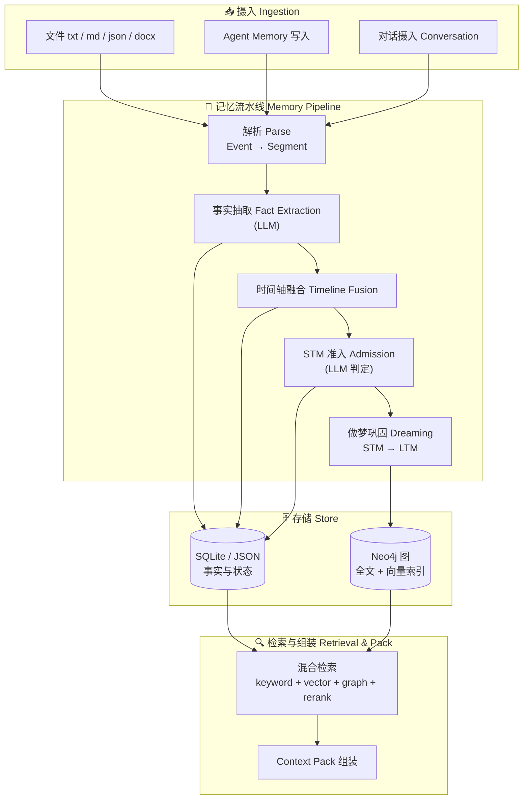

<div align="center">

# 🧠 Nexcore Context Engine

**仿人类记忆模型的 Agent 上下文引擎**——为 LLM Agent 提供可持久化、可检索、可推理的长期记忆。

<br/>

[](https://www.typescriptlang.org/)
[](https://fastify.dev/)
[](https://react.dev/)
[](https://neo4j.com/)
[](https://pnpm.io/)
[](https://www.gnu.org/licenses/agpl-3.0)

</div>

---

Nexcore Context Engine 把「短期记忆 → 长期记忆」的认知过程落实为一条可观测、可评测的流水线：将对话与文档摄入为**事件（Event）**，经 LLM 抽取为**结构化事实（Fact）**，做**时间轴融合**后按策略准入**短期记忆（STM）**，再通过「做梦」式巩固（Dreaming / Consolidation）沉淀为**长期记忆（LTM）**，最终在需要时完成**检索**与 **Context Pack 组装**，为下游 Agent 提供带来源引用的上下文。

## 目录

- [✨ 核心特性](#-核心特性)
- [🧠 记忆模型](#-记忆模型)
- [🏗️ 架构](#-架构)
- [🛠️ 技术栈](#-技术栈)
- [📁 项目结构](#-项目结构)
- [🚀 快速开始](#-快速开始)
- [⚙️ 配置](#-配置)
- [📚 核心链路](#-核心链路)
- [🔌 HTTP API](#-http-api)
- [📊 评测与基准](#-评测与基准)
- [📖 文档](#-文档)
- [🤝 贡献](#-贡献)
- [📄 License](#-license)

## ✨ 核心特性

| 能力 | 说明 |
| --- | --- |
| 📥 多源摄入 | 文件（`.txt` / `.md` / `.json` / `.docx`）、Agent 写入、对话流，统一归一为 `MemoryEvent` |
| 🔍 LLM 事实抽取 | 从非结构化文本抽取带时间与来源的**结构化事实**，支持批量与幂等写入 |
| ⏱️ 时间轴融合 | 对事实做时间推理与聚合，构建可查询的时间线，支撑「时间相关」类问答 |
| 🧩 STM 准入 | 由 LLM 判定事实是否进入短期记忆，附带准入原因与证据 |
| 🌙 做梦巩固 | 定时/手动触发的 `dreaming` 机制，以七维评分把 STM 巩固为 LTM（创建 / 修订 / 冲突消解） |
| 🔎 混合检索 | 关键词 + 向量（`bge-m3`）+ 图召回 + 交叉编码器重排，输出带分数分解的候选 |
| 🧠 记忆图 | Neo4j 存 STM/LTM 节点与关系，支持全文 + 向量索引，提供只读图查询 API |
| 📦 Context Pack | 组装 profile / task / recent 上下文，附引用（citation）与权限快照 |
| 🔐 权限与幂等 | 幂等写入、权限快照、来源引用，调试接口支持 `includeInactive` 查看被过滤项 |
| 🧪 评测闭环 | 内置 LongMemEval 与 LoCoMo 评测链路，端到端可复现 |

## 🧠 记忆模型

引擎借鉴人类记忆的「短时 → 长时」结构，把记忆生命周期拆成若干可独立观测的层：

```
Event ──parse──▶ Segment ──LLM抽取──▶ Fact ──时间轴融合──▶ STM ──做梦巩固──▶ LTM
   (原始事件)      (解析片段)        (结构化事实)    (时间线)   (短期记忆)      (长期记忆)
```

- **Event / Segment**：一次原始输入及其解析产物。
- **Fact**：LLM 抽取出的、带时间与来源声明的结构化事实，是检索的基本单元。
- **STM（短期记忆）**：刚通过准入判断的事实，权重高、易失效。
- **LTM（长期记忆）**：经做梦巩固后的稳定记忆，支持 `revise` / `weaken` / `archive` 等生命周期操作。

做梦巩固的七维评分定义、分数锚点与校准样例见 [STM 到 LTM 七维评分 Prompt](./STM到LTM七维评分Prompt.md)。

## 🏗️ 架构



## 🛠️ 技术栈

| 层 | 技术 |
| --- | --- |
| Monorepo | [pnpm workspaces](https://pnpm.io/workspaces) |
| 后端 | [Fastify](https://fastify.dev/) + TypeScript + [tsx](https://tsx.is/) |
| 前端 | [React 18](https://react.dev/) + [Vite 5](https://vitejs.dev/) |
| 图存储 | [Neo4j](https://neo4j.com/)（全文 + 向量索引） |
| 本地存储 | SQLite / JSON 文件 |
| LLM | OpenAI-compatible（默认 `qwen3.7-flash`，经 DashScope） |
| Embedding | OpenAI-compatible（默认 `bge-m3`，经 SiliconFlow） |

## 📁 项目结构

```
context-egine/
├── apps/
│   ├── backend/              # Fastify 后端：摄入、记忆流水线、检索、评测 CLI
│   │   └── src/modules/context-engine/   # 核心引擎实现
│   ├── web/                  # React + Vite 调试台
│   └── video/                # Remotion 记忆引擎演示视频
├── packages/
│   └── shared/               # 前后端共享类型（MemoryEvent / ContextPack / …）
├── config/
│   └── context-engine.json   # 引擎主配置
├── datasets/                 # LongMemEval / LoCoMo 评测数据集
├── docs/                     # 方案、评测报告与运行手册
├── openspec/                 # OpenSpec 规格驱动的变更规划
└── data/                     # 运行时存储（inbox、SQLite、评测产物）
```

## 🚀 快速开始

### 运行前提

- Node.js 22+
- pnpm 10+
- （可选）Neo4j 5.x，用于图存储与向量/全文检索

### 安装与启动

```bash
# 安装依赖
pnpm install

# 启动后端 + 前端（并行）
pnpm dev

# 或分别启动
pnpm --filter @nexcore/backend dev   # 后端，默认 http://localhost:3101
pnpm --filter @nexcore/web dev       # 调试台，默认 http://localhost:5173
```

启动后打开 `http://localhost:5173` 即可进入调试台，写入测试记忆事件并查看解析、事实、STM、LTM 与融合时间轴。

### 一条链路跑通

```bash
# 1. 写入一条 Agent 记忆
curl -X POST http://localhost:3101/context/agent-memory \
  -H 'content-type: application/json' \
  -d '{
    "content": "用户偏好：回答要短，但要给验证证据。",
    "idempotencyKey": "basic-memory-demo-1",
    "sourceApp": "agent",
    "sourceId": "chat-session-demo"
  }'

# 2. 检索刚写入的记忆
curl 'http://localhost:3101/context/search?q=验证证据&layer=all&limit=5'
```

## ⚙️ 配置

默认配置文件为 [`config/context-engine.json`](config/context-engine.json)，后端与前端代理都会读取。可用 `CONTEXT_ENGINE_CONFIG` 指向另一份配置：

```bash
CONTEXT_ENGINE_CONFIG=/absolute/path/context-engine.json pnpm dev
```

配置结构（示例）：

```json
{
  "server": { "host": "127.0.0.1", "port": 3101 },
  "dreaming": { "enabled": true },
  "storage": { "storePath": "data/context-engine-store.json" },
  "ingestion": { "inboxDirectory": "data/inbox" },
  "llm": {
    "provider": "openai-compatible",
    "baseUrl": "https://dashscope.aliyuncs.com/compatible-mode/v1",
    "model": "qwen3.7-flash",
    "apiKeyEnv": "OPENAI_API_KEY"
  },
  "embedding": {
    "protocol": "openai-compatible",
    "model": "BAAI/bge-m3",
    "apiKeyEnv": "EMBEDDING_API_KEY",
    "dimensions": 1024
  },
  "graphStore": {
    "mode": "neo4j",
    "neo4j": { "uri": "neo4j://127.0.0.1:7687", "database": "neo4j" }
  }
}
```

### 环境变量

部署或本地调试时，以下环境变量会覆盖配置文件：

| 环境变量 | 作用 |
| --- | --- |
| `PORT` | 后端端口（同时影响前端代理目标端口） |
| `CONTEXT_ENGINE_STORE_PATH` | 持久化 JSON 文件路径 |
| `CONTEXT_ENGINE_INBOX_DIR` | 固定文件摄入目录 |
| `OPENAI_BASE_URL` / `OPENAI_MODEL` / `OPENAI_API_KEY` | LLM 相关覆盖 |
| `LONGMEMEVAL_STORE_DIR` | LongMemEval 独立 SQLite 存储目录 |
| `LONGMEMEVAL_GRAPH_STORE` | LongMemEval 图存储模式：`inherit` / `local` / `neo4j` |
| `LONGMEMEVAL_NEO4J_*` | LongMemEval 独立 Neo4j 连接、索引名等 |

`longMemEval.graphStore.mode` 默认为 `inherit`（沿用主 `graphStore`）；设为 `local` 只用独立 SQLite；设为 `neo4j` 使用 `longMemEval.graphStore.neo4j`，未填写的字段继承主 `graphStore.neo4j`。

## 📚 核心链路

### 文件摄入

后端扫描固定目录 `data/inbox` 的第一层文件（`.txt` / `.md` / `.json` / `.docx`），生成 `MemoryEvent` 进入解析链路。`.docx` 从 `word/document.xml` 提取正文（暂不提取批注、修订、页眉页脚）；`.xlsx` / `.pptx` / 图片会生成 unsupported 事件。

```bash
# 把文件放入 data/inbox，然后触发扫描
curl -X POST http://localhost:3101/context/ingest/files \
  -H 'content-type: application/json' -d '{}'
```

去重规则：`file path + mtime + size` 生成幂等 key，同一文件重复扫描不会重复写入，文件修改后视为新版本重新摄入。

### 结构化事实导入

对 `序号 / 事实发生时间 / 记忆类型 / 事实记忆 / 来源类型` 测试表，用确定性脚本导入（不调用 LLM）：

```bash
pnpm import:weekly-facts --dry-run
pnpm import:weekly-facts --apply
```

脚本默认读取根目录的 `极核产品经理一周事实记忆假数据.md`，写入 `synthetic-test` 租户，并可用 `--file` / `--dataset-id` / `--tenant` / `--principal` 覆盖。

## 🔌 HTTP API

### 摄入与写入

| 方法 | 路径 | 说明 |
| --- | --- | --- |
| `POST` | `/context/events` | 写入原始 `MemoryEvent` |
| `POST` | `/context/agent-memory` | Agent 快速写入（受控事件 + 复用解析/准入链路） |
| `POST` | `/context/ingest/files` | 扫描 `data/inbox` 文件 |

### 检索与组装

| 方法 | 路径 | 说明 |
| --- | --- | --- |
| `POST` | `/context/search` | 检索 fact/STM/LTM，返回分数分解与来源引用 |
| `POST` | `/context/assemble` | 组装 Context Pack |
| `GET` | `/context/read` | 读取上下文 |
| `POST` | `/context/memory-graph/query` | 只读分页查询记忆图节点与关系 |

### 记忆图查询

```bash
curl -sS -X POST http://localhost:3101/context/memory-graph/query \
  -H 'content-type: application/json' \
  -d '{ "page": 1, "nodePage": { "limit": 100 }, "edgePage": { "limit": 500 } }' | jq .
```

响应使用 `memory-graph.v1`，节点与边共用顶层 `page` 但各自管理 limit，可用 `nextCursor` 稳定遍历。接口按「单用户 engine」设计，不做 owner 隔离，采用最终一致语义，不返回 embedding / 内部 graph node ID / Prompt / 调试 Trace。

### 做梦巩固（Dreaming）

| 方法 | 路径 | 说明 |
| --- | --- | --- |
| `POST` | `/context/dreaming/runs` | 创建 dreaming run |
| `GET` | `/context/dreaming/runs` | 列出 dreaming run |
| `POST` | `/context/dreaming/run` | 手动触发一次巩固 |

### 调试与反馈

```bash
GET    /context/debug/snapshot
GET    /context/tools
POST   /context/debug/manual-flow
POST   /context/debug/manual-step
POST   /context/feedback
POST   /context/permissions/invalidate
DELETE /context/debug/data
```

调试检索时加 `includeInactive=true` 可查看被过滤项；检索结果包含 `scoreBreakdown`、`permissionStatus` 与 dropped 原因。

## 📊 评测与基准

仓库保留三条语义不同的评测链路：

| 命令 | 语义 |
| --- | --- |
| `eval:longmemeval` | LongMemEval 端到端，一题对应一个隔离 haystack |
| `eval:locomo` | LoCoMo 原生端到端，一个长对话只摄入一次，全部问题共享同一隔离 scope |

### LongMemEval

```bash
# 完整数据集评测
pnpm --filter @nexcore/backend eval:longmemeval datasets/LongMemEval/longmemeval_s_cleaned.json

# 按题目 ID / 区间
pnpm --filter @nexcore/backend eval:longmemeval sample \
  --dataset datasets/LongMemEval/longmemeval_s_cleaned.json --question-id e47becba

# 比例切分 + CI（stdout 仅 JSON）
pnpm --filter @nexcore/backend eval:longmemeval split \
  --dataset datasets/LongMemEval/longmemeval_s_cleaned.json \
  --ratio 0.1 --seed 20260806 --ci --result artifacts/longmemeval-result.json
```

完整操作手册见 [`docs/longmemeval-cli-benchmark.md`](docs/longmemeval-cli-benchmark.md)。

### LoCoMo 原生

```bash
# 准备一个 conversation 的 Fact/STM Store
pnpm --filter @nexcore/backend eval:locomo prepare \
  --sample-id conv-26 --store-path data/longmemeval/locomo-conv-26.sqlite

# 使用已准备 Store 只读评测
pnpm --filter @nexcore/backend eval:locomo evaluate \
  --sample-id conv-26 --store-path data/longmemeval/locomo-conv-26.sqlite \
  --result artifacts/locomo-conv-26.results.jsonl \
  --trace artifacts/locomo-conv-26.trace.jsonl \
  --summary artifacts/locomo-conv-26.summary.json

# 准备并评测前两个 conversation
pnpm --filter @nexcore/backend eval:locomo full --sample-range 1:2
```

官方 QA 指标是逐题 token F1 的自然加权平均，报告同时提供各 category 平均分与 `perfectScoreRate`。只评测 category 1-4，对抗性/不可回答题型（category 5）不参与答题与评分。可复现实验应固定数据集 SHA-256、模型/embedding 配置、profile 和独立 Store 路径。

### 候选召回 Benchmark

```bash
pnpm --filter @nexcore/backend eval:retrieval -- \
  --dataset data/longmemeval_s_cleaned.json \
  --output artifacts/retrieval-baseline.json \
  --diagnostics artifacts/retrieval-baseline.jsonl
```

报告包含 Recall / Precision / MRR / NDCG，以及分阶段诊断（`fact_not_generated`、`memory_not_indexed`、`not_in_top_k` 等）。

## 📖 文档

核心方案与运行手册集中在 `docs/`，重要的入口：

- [LoCoMo 原生评测运行手册](docs/locomo-native-evaluation.md)
- [LoCoMo 检索召回与精排优化总报告](docs/locomo-retrieval-optimization-report.md)
- [LongMemEval CLI Benchmark 指南](docs/longmemeval-cli-benchmark.md)
- [Context Engine 图召回优化方案](docs/Context-Engine-图召回优化方案.md)

仓库根目录还保留了历史实现方案（`Context-Engine-*.md`、`背景上下文技术方案.md` 等），可作为设计回溯。

## 🤝 贡献

项目使用 [OpenSpec](https://openspec.dev/) 做规格驱动开发，变更规划沉淀在 `openspec/changes/` 下。贡献流程：

```bash
openspec list
openspec validate <change-name>
openspec status --change <change-name>
```

提交与 PR 规范详见 [AGENTS.md](AGENTS.md)。提交前请运行：

```bash
pnpm build
pnpm typecheck
pnpm test
```

## 📄 License

本项目采用 [GNU Affero General Public License v3.0 (AGPL-3.0)](https://www.gnu.org/licenses/agpl-3.0) 许可协议。

AGPL-3.0 要求：任何通过网络提供本软件功能的服务，都必须向用户开放其修改后的完整源代码。完整条款见 [LICENSE](LICENSE)。
